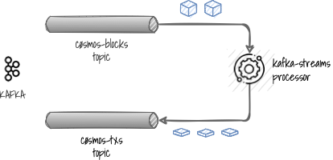

# Kafka Streams CØSMOS-Blocks

> A Kafka Streams Processor to unwrap CØSMOS blocks into CØSMOS transactions.

[](https://conventionalcommits.org)

## Purpose

The Kafka Streams CØSMOS-Blocks is basically a stream processor which continuously reads [CØSMOS blocks](https://docs.cosmos.network/master/intro/sdk-app-architecture.html) from an `input` Kafka topic, 
unwraps the CØSMOS transactions and sends them to an `output` topic.

<p align="center">
  
</p>

This processor plays well with the [CØSMOS Kafka Connector](github.com/okp4/kafka-connector-cosmos)
which provides Kafka with CØSMOS blocks ready to be processed.

## Implementation

Implementation mainly relies on [Kafka Streams API](https://kafka.apache.org/documentation/streams), library to create
event-stream applications with the following features:
- no external dependency other than Kafka itself
- simple and light library
- fault-tolerant and scalable

Moreover, this implementation:
- uses [Kotkin](https://kotlinlang.org/) as primary coding language.
- is as much as possible, lean, i.e. tries to minimize the dependencies to 3rd party libraries and the resulting package footprint.

## Build

This project targets the [JVM 11+](https://openjdk.java.net/), so be sure to have it available in your environment.

This project relies on the [Gradle](https://gradle.org/) build system.

If you are on windows then open a command line, go into the root directory and run:

```sh
.\gradlew build
```

If you are on linux/mac then open a terminal, go into the root directory and run:

```sh
./gradlew build
```

This command line produces 2 JAR files:
- a _regular_ JAR: `kafka-streams-cosmos-blocks-X.Y.jar`
- a _fat_ JAR: `kafka-streams-cosmos-block-X.Y-standalone.jar`

This last one is the one to use as it contains all the dependencies in it.
